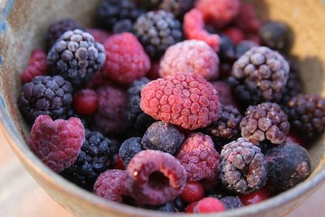

Нашите плодови се од македонското поднебје ,поточно рачно берени шумски плодови од Кожуф планина.Ние сме достапна  он-лајн продавница за нарачки,можете да не контактирате на нашите профили или на телефонскиот број оставени во прилог.

Подигнувањето на производите е секој работен ден од понеделник до сабота од 09 до 21часот во Ѓорче Петров на главната улица во зградата(до салон за мебел NATUZZI ) со претходна најава. 

Во недела вршиме достава на бараните производи до вашите домови. Доставата до адреса се наплаќа 100 денари.
