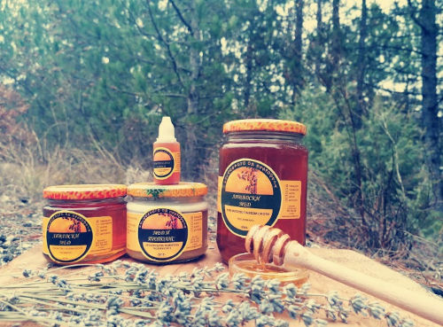

Пчеларство Ташеви Скоти е фамилија која веќе четири генерации по ред се занимава со пчеларство. Ние пчелариме на три пчеларника на различни локации во пределот на  на Општина Неготино односно Тиквешкиот регион. Располагаме со бројка од околу 150 пчелни семејства. Според направените тестирања пчелите со кои ние располагаме потекнуваат од родот апис малифера македоника, со чистина од 83%.

Она за што се залагаме е происвотство на чисти и природни пчелни производи. Кои ќе бидат од големо значање за секој поединец. Како пчеларска фамилија произведуваме повеке видови на пчелни производи и тоа: Ливадски мед, Мед и Прополис, Прополисови капки, Мед и матичен млеч. Секој еден производ е направен со големо внимание за тоа да биде што е можно повеќе чист и природен дирекно како што го создала природата.